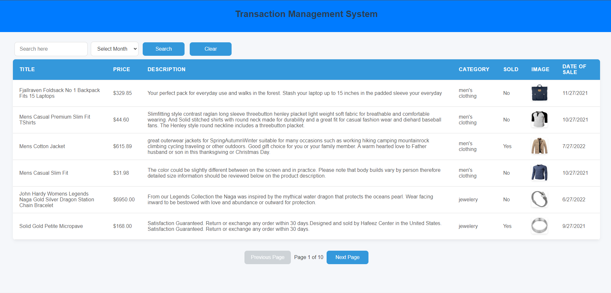

---

# Roxiler Systems Assessment

 <!-- Replace with your logo or relevant image -->
 <!-- Replace with your logo or relevant image -->

## Overview

The **Transaction Management System** is designed to manage and display product transactions using a third-party API. This application consists of a robust backend API for data initialization and statistics, along with a user-friendly frontend interface that presents transaction data in tables and various charts.

---

## Table of Contents

- [Technologies Used](#technologies-used)
- [API Endpoints](#api-endpoints)
- [Frontend Functionality](#frontend-functionality)
- [Database Structure](#database-structure)
- [Installation](#installation)
- [Usage](#usage)

---

## Technologies Used

- **Node.js**: Server-side JavaScript runtime
- **Express.js**: Web application framework for Node.js
- **MongoDB**: NoSQL database (or your chosen database)
- **Mongoose**: MongoDB object modeling tool
- **React**: JavaScript library for building user interfaces
- **Chart.js**: JavaScript library for charts
- **Axios**: Promise-based HTTP client for API calls

---

## API Endpoints

### Initialize Database
- **Endpoint:** `GET /api/initialize`
- **Description:** Fetches JSON data from a third-party API and initializes the database with seed data.

### List Transactions
- **Endpoint:** `GET /api/transactions`
- **Parameters:**
  - `month`: _(Number)_ Month  (e.g., "1")
  - `page`: _(Number)_ Page number for pagination (default: 1)
  - `perPage`: _(Number)_ Number of transactions per page (default: 10)
  - `search`: _(String)_ Search text for product title/description/price
- **Description:** Lists all transactions, supports search and pagination.

### Statistics
- **Endpoint:** `GET /api/statistics`
- **Parameters:**
  - `month`: _(Number)_ Month  (e.g., "1")
- **Description:** Returns total sale amount, total sold items, and total unsold items for the selected month.

### Bar Chart Data
- **Endpoint:** `GET /api/bar-chart`
- **Parameters:**
  - `month`: _(Number)_ Month  (e.g., "1")
- **Description:** Returns price ranges and the number of items in those ranges for the selected month.

### Pie Chart Data
- **Endpoint:** `GET /api/pie-chart`
- **Parameters:**
  - `month`: _(Number)_ Month  (e.g., "1")
- **Description:** Returns unique categories and the number of items in each category for the selected month.

### Combined API
- **Endpoint:** `GET /api/combined` 
- **Parameters:**
  - `month`: _(Number)_ Month  (e.g., "1") 
  - `year`: _(Number)_ Year (e.g., "2022")
- **Description:** Fetches data from the above three APIs and returns a combined JSON response.

---

## Frontend Functionality

- **Transaction Table**: Displays transactions for the selected month (default: March).
- **Month Dropdown**: Select a month from January to December.
- **Search Box**: Filter transactions based on title, description, or price.
- **Pagination Controls**: Navigate through transaction pages.
- **Statistics Box**: Displays total sales, sold items, and unsold items for the selected month.
- **Bar Chart**: Shows price ranges and the number of items for the selected month.

---

## Database Structure

```json
{
  "transaction": {
    "id": "String",
    "title": "String",
    "description": "String",
    "price": "Number",
    "dateOfSale": "Date",
    "category": "String",
    "image": "String",
    "sold": "Boolean"
  }
}
```

---

## Installation

1. **Clone the repository**:
   <div>
   <button onclick="copyToClipboard(`git clone https://github.com/VibesEZ/Roxlier_Online_Assessment.git`)"></button>
   <pre><code>git clone https://github.com/VibesEZ/Roxlier_Online_Assessment.git</code></pre>
   <button onclick="copyToClipboard(`cd Roxlier_Online_Assessment`)"></button>
   <pre><code>cd Roxlier_Online_Assessment</code></pre>
   </div>

2. **Navigate to the backend directory**:
   <div>
   <button onclick="copyToClipboard(`cd backend`)"></button>
   <pre><code>cd backend</code></pre>
   </div>

3. **Install the required packages**:
   <div>
   <button onclick="copyToClipboard(`npm install`)"></button>
   <pre><code>npm install</code></pre>
   </div>

4. **Navigate to the frontend directory**:
   <div>
   <button onclick="copyToClipboard(`cd frontend`)"></button>
   <pre><code>cd frontend</code></pre>
   </div>

5. **Install the required packages**:
   <div>
   <button onclick="copyToClipboard(`npm install`)"></button>
   <pre><code>npm install</code></pre>
   </div>

6. **Start the server**:
   <div>
   <button onclick="copyToClipboard(`npm start`)"></button>
   <pre><code>npm start</code></pre>
   </div>


## Usage

- Access the backend API at: `http://localhost:5000`
- Visit the frontend at: `http://localhost:3000`

---

## Contributing

Contributions are welcome! Please fork the repository and submit a pull request with your changes.

---

Feel free to modify any specific details as necessary, especially regarding your database structure and additional functionality!
